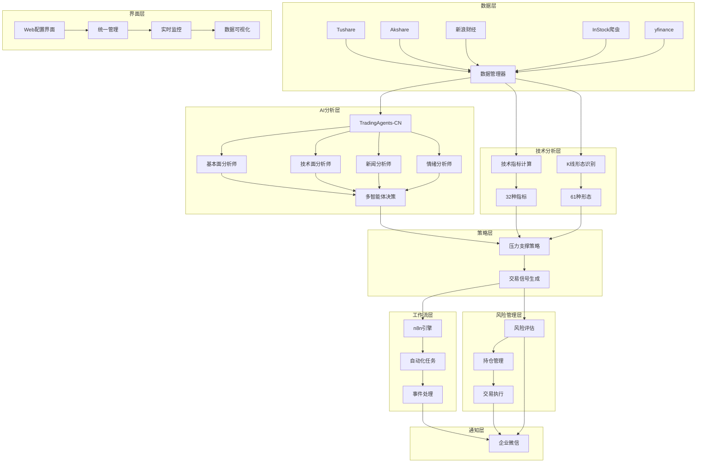

# 🚀 AI量化股票交易系统

<div align="center">

[](https://www.python.org/downloads/)
[](LICENSE)
[](https://hub.docker.com)
[](https://github.com/hsliuping/TradingAgents-CN)
[](https://github.com/myhhub/stock)

**基于多智能体AI的全球股票量化交易决策系统**

支持A股、港股、美股 | 32种技术指标 | 61种K线形态 | AI多智能体分析 | 工作流自动化

[快速开始](#-快速开始) • [功能特性](#-功能特性) • [系统架构](#-系统架构) • [安装部署](#-安装部署) • [使用文档](#-使用文档)

</div>

---

## ✨ 功能特性

### 🤖 AI多智能体分析
- **多智能体协作**: 基本面、技术面、新闻面、社交媒体四大分析师
- **结构化辩论**: 看涨/看跌研究员深度分析
- **智能决策**: 交易员基于所有输入做出最终投资建议
- **多LLM支持**: 阿里百炼、DeepSeek、Google AI、OpenRouter等
- **中文优化**: 完整A股/港股/美股支持，中文本地化

### 📈 全球股票数据
- **多市场覆盖**: A股、港股、美股实时数据获取
- **多时间周期**: 日K、周K、月K线数据
- **实时行情**: 价格、成交量、涨跌幅等实时更新
- **历史数据**: 支持任意时间段历史数据回溯
- **数据质量**: 多数据源验证，确保数据准确性

### 🔧 技术分析引擎
- **32种技术指标**: MACD、KDJ、RSI、BOLL、CCI、WR、ATR等
- **61种K线形态**: 锤头、十字星、吞没形态、晨星暮星等
- **智能信号**: 自动生成买卖信号和交易建议
- **形态识别**: 基于TA-Lib的专业K线形态识别
- **指标优化**: 结果与同花顺、通达信一致

### ⚙️ 工作流自动化
- **可视化编辑**: 拖拽式工作流设计器
- **400+集成**: 支持各种第三方服务连接
- **事件驱动**: 基于市场事件的自动化执行
- **模板库**: 预定义交易工作流模板
- **实时监控**: 工作流执行状态实时跟踪

### 🎛️ 统一配置管理
- **Web界面**: 现代化响应式配置界面
- **一站式管理**: 所有系统配置集中管理
- **实时验证**: 配置修改即时验证有效性
- **连接测试**: 数据源和服务连接测试
- **配置导入导出**: 支持配置备份和迁移

### 🛡️ 风险管理系统
- **多层风险控制**: 持仓限制、止损止盈、风险敞口控制
- **实时监控**: 持仓风险实时评估
- **智能预警**: 基于AI的风险预警系统
- **压力测试**: 极端市场情况模拟
- **合规检查**: 交易合规性自动检查

### 📱 企业微信通知
- **实时推送**: 交易信号、市场预警即时通知
- **多种消息**: 支持文本、Markdown、图片等格式
- **智能过滤**: 重要信息优先推送
- **群组管理**: 支持多群组分类推送
- **消息模板**: 预定义消息格式模板

---

## 🏗️ 系统架构



---

## 📦 核心模块

### 🔍 数据获取模块
```python
from src.data.stock_crawler import EnhancedDataProvider

# 创建增强数据提供者
provider = EnhancedDataProvider(config)

# 获取增强股票数据（包含技术指标和K线形态）
data = await provider.get_enhanced_stock_data(
    symbol='000001.SZ',
    include_indicators=True,
    include_patterns=True
)

print(f"当前价格: {data.basic_data.current_price}")
print(f"技术指标: {len(data.indicators)}个")
print(f"K线形态: {len(data.patterns)}个")
```

### 🤖 AI分析模块
```python
from src.ai_analysis import TradingAgentsAdapter

# 创建AI分析适配器
ai_adapter = TradingAgentsAdapter({
    'llm_provider': 'dashscope',
    'deep_think_llm': 'qwen-plus',
    'dashscope_api_key': 'your_api_key'
})

# AI分析股票
result = await ai_adapter.analyze_stock('AAPL')
print(f"AI决策: {result.decision['action']}")
print(f"信心度: {result.confidence:.2%}")
print(f"推理: {result.reasoning}")
```

### 📊 技术分析模块
```python
from src.data.stock_crawler import TechnicalIndicators, KLinePatterns

# 技术指标计算
indicators = TechnicalIndicators()
results = indicators.calculate_all_indicators(df)

# K线形态识别
patterns = KLinePatterns()
pattern_results = patterns.recognize_all_patterns(df)

print(f"识别到{len(results)}个技术指标")
print(f"识别到{len(pattern_results)}个K线形态")
```

---

## 🛠️ 安装部署

### 环境要求
- Python 3.10+
- MySQL 5.7+ 或 SQLite
- Redis (可选，用于缓存)
- TA-Lib (技术分析库)

### 快速安装

#### 1. 克隆项目
```bash
git clone https://github.com/your-repo/Quant-Stock-Alpha-Engine.git
cd Quant-Stock-Alpha-Engine
```

#### 2. 创建虚拟环境
```bash
python -m venv venv

# Windows
venv\Scripts\activate

# Linux/macOS
source venv/bin/activate
```

#### 3. 安装依赖
```bash
# 基础依赖
pip install -r requirements.txt

# 安装TA-Lib (技术分析库)
# Windows: 下载whl文件安装
# Linux: sudo apt-get install ta-lib
# macOS: brew install ta-lib

# AI功能依赖 (可选)
pip install tradingagents-cn dashscope openai google-generativeai
```

#### 4. 配置环境变量
```bash
cp .env.example .env
# 编辑.env文件，填入API密钥
```

#### 5. 启动系统
```bash
# 启动主系统
bash scripts/start.sh

# 启动Web配置界面
python3 scripts/start_web_config.py

# 或使用部署脚本
bash deployment/deploy.sh dev
```

### Docker部署

```bash
# 使用部署脚本（推荐）
bash deployment/deploy.sh docker

# 或手动部署
cd deployment
docker-compose up -d

# 检查服务状态
docker-compose ps
```

---

## 🎯 快速开始

### 🚀 快速启动

1. **启动Web配置界面**:
   ```bash
   python3 scripts/start_web_config.py
   # 访问 http://127.0.0.1:8080
   ```

2. **运行系统测试**:
   ```bash
   python3 scripts/run_tests.py --quick
   ```

3. **启动交易系统**:
   ```bash
   bash scripts/start.sh
   ```

4. **Docker部署**:
   ```bash
   bash deployment/deploy.sh docker
   ```

5. **运行示例**:
   ```bash
   python3 examples/basic_usage.py
   ```

### 1. 基础配置

访问Web配置界面：http://localhost:8080

1. **数据源配置**：配置Tushare、Akshare等API密钥
2. **AI模型配置**：选择LLM提供商和模型
3. **监控股票**：添加要监控的股票代码
4. **风险参数**：设置止损止盈等风险控制参数
5. **通知配置**：配置企业微信Webhook

### 2. 运行测试

```bash
# 运行系统测试
python3 scripts/test_system.py

# 运行自动化测试
python3 scripts/run_tests.py --quick

# 运行完整测试
python3 scripts/run_tests.py
```

### 3. 启动交易

```bash
# 启动完整系统
python3 main.py

# 或使用启动脚本
bash scripts/start.sh

# 开发环境部署
bash deployment/deploy.sh dev
```

### 4. 监控运行

- **Web界面**：http://localhost:8080 - 配置管理
- **系统日志**：logs/trading.log - 运行日志
- **企业微信**：接收实时交易信号和预警

---

## 📊 使用示例

### 股票分析示例

```python
import asyncio
from src.data.stock_crawler import EnhancedDataProvider
from src.ai_analysis import TradingAgentsAdapter

async def analyze_stock_example():
    # 1. 获取增强股票数据
    provider = EnhancedDataProvider()
    stock_data = await provider.get_enhanced_stock_data('000001.SZ')
    
    print(f"=== {stock_data.basic_data.name} 技术分析 ===")
    print(f"当前价格: ¥{stock_data.basic_data.current_price}")
    print(f"涨跌幅: {stock_data.basic_data.change_percent:.2f}%")
    
    # 2. 技术指标分析
    print(f"\n技术指标({len(stock_data.indicators)}个):")
    for name, indicator in stock_data.indicators.items():
        if indicator.signals:
            print(f"  {name}: {indicator.signals[-1]}")
    
    # 3. K线形态分析
    print(f"\nK线形态({len(stock_data.patterns)}个):")
    for name, pattern in stock_data.patterns.items():
        if pattern.signals:
            print(f"  {pattern.chinese_name}: {pattern.signals[-1]}")
    
    # 4. AI智能分析
    ai_adapter = TradingAgentsAdapter({
        'llm_provider': 'dashscope',
        'deep_think_llm': 'qwen-plus'
    })
    
    ai_result = await ai_adapter.analyze_stock('000001.SZ')
    if ai_result:
        print(f"\n=== AI分析结果 ===")
        print(f"决策: {ai_result.decision['action']}")
        print(f"信心度: {ai_result.confidence:.1%}")
        print(f"风险评分: {ai_result.risk_score:.1%}")
        print(f"推理: {ai_result.reasoning}")
        
        print(f"\n投资建议:")
        for rec in ai_result.recommendations:
            print(f"  • {rec}")

# 运行示例
asyncio.run(analyze_stock_example())
```

### 批量分析示例

```python
async def batch_analysis_example():
    provider = EnhancedDataProvider()
    
    # 批量获取多只股票数据
    symbols = ['000001.SZ', '000002.SZ', '600519.SH', 'AAPL', 'TSLA']
    results = await provider.get_multiple_enhanced_data(symbols)
    
    print("=== 批量分析结果 ===")
    for symbol, data in results.items():
        sentiment = data.analysis_summary['overall_sentiment']
        score = data.analysis_summary['scores']['overall']
        print(f"{symbol}: {sentiment.upper()} (评分: {score:.1f})")
    
    # 市场概览
    overview = await provider.get_market_overview(symbols)
    print(f"\n=== 市场概览 ===")
    print(f"看涨股票: {overview['market_sentiment']['bullish']}只")
    print(f"看跌股票: {overview['market_sentiment']['bearish']}只")
    print(f"平均涨跌: {overview['market_performance']['avg_change_percent']:.2f}%")

asyncio.run(batch_analysis_example())
```

---

## 🔧 高级配置

### AI模型配置

```yaml
# config.yaml
ai_analysis:
  llm_provider: "dashscope"  # dashscope, deepseek, google, openrouter
  deep_think_llm: "qwen-plus"
  quick_think_llm: "qwen-turbo"
  max_debate_rounds: 2
  enable_news_analysis: true
  risk_tolerance: "medium"
```

### 技术指标配置

```yaml
technical_analysis:
  indicators:
    - name: "MACD"
      params: {fast: 12, slow: 26, signal: 9}
    - name: "RSI"
      params: {period: 14}
    - name: "KDJ"
      params: {k_period: 9, d_period: 3}
  
  patterns:
    enabled: true
    confidence_threshold: 0.7
```

### 风险管理配置

```yaml
risk_management:
  max_position_size: 50000      # 单只股票最大仓位
  max_positions: 10             # 最大持仓数量
  stop_loss: 0.05              # 止损比例
  take_profit: 0.15            # 止盈比例
  risk_tolerance: 0.02         # 风险容忍度
  daily_loss_limit: 0.03       # 日内最大亏损
```

---

## 📈 性能监控

### 系统指标

- **数据获取延迟**: < 2秒
- **AI分析时间**: 10-30秒
- **技术指标计算**: < 1秒
- **内存使用**: < 1GB
- **并发处理**: 支持10+股票同时分析

### 监控面板

访问 http://localhost:8080 查看：

- 📊 实时系统状态
- 📈 交易信号统计
- 🔔 预警信息汇总
- 📋 系统运行日志
- 💹 持仓风险监控

---

## 🔒 安全说明

### 数据安全
- ✅ API密钥加密存储
- ✅ 本地数据处理，不上传敏感信息
- ✅ 支持自托管部署
- ✅ 数据传输HTTPS加密

### 交易安全
- ⚠️ **本系统仅用于分析和研究，不直接执行真实交易**
- ⚠️ **所有投资决策请谨慎评估，风险自担**
- ⚠️ **建议在模拟环境中充分测试后再考虑实盘应用**

### 合规声明
- 📋 遵循相关金融法规
- 📋 不提供投资建议
- 📋 仅供学习研究使用

---

## 🤝 集成项目

本系统集成了以下优秀开源项目：

### 📊 [InStock股票系统](https://github.com/myhhub/stock)
- **功能**: 股票数据获取、技术指标计算、K线形态识别
- **特色**: 支持A股/港股/美股，32种技术指标，61种K线形态
- **集成**: `src/data/stock_crawler/`

### 🤖 [TradingAgents-CN](https://github.com/hsliuping/TradingAgents-CN)
- **功能**: 多智能体AI分析框架
- **特色**: 中文优化，支持多LLM，智能新闻分析
- **集成**: `src/ai_analysis/`

### ⚙️ [n8n工作流自动化](https://github.com/n8n-io/n8n)
- **功能**: 可视化工作流自动化
- **特色**: 400+集成，拖拽式编辑，事件驱动
- **集成**: `src/workflow/`

---

## 🚀 开发计划

### 🎯 近期目标 (v2.1)
- [ ] 完善AI分析报告生成
- [ ] 增加更多技术指标
- [ ] 优化Web界面体验
- [ ] 添加移动端支持

### 🎯 中期目标 (v2.5)
- [ ] 机器学习策略优化
- [ ] 多账户组合管理
- [ ] 高频数据支持
- [ ] 云端部署方案

### 🎯 长期目标 (v3.0)
- [ ] 期货期权支持
- [ ] 量化因子挖掘
- [ ] 社区策略分享
- [ ] 专业版商业化

---

## 🤝 贡献指南

我们欢迎所有形式的贡献！

### 如何贡献

1. **Fork** 本仓库
2. **创建** 特性分支 (`git checkout -b feature/AmazingFeature`)
3. **提交** 更改 (`git commit -m 'Add some AmazingFeature'`)
4. **推送** 到分支 (`git push origin feature/AmazingFeature`)
5. **打开** Pull Request

### 贡献类型

- 🐛 Bug修复
- ✨ 新功能开发
- 📚 文档改进
- 🎨 UI/UX优化
- 🔧 性能优化
- 🧪 测试用例

### 开发环境

```bash
# 安装开发依赖
pip install -r requirements-dev.txt

# 运行测试
python3 scripts/run_tests.py

# 代码格式化
black src/
flake8 src/

# 使用开发环境
bash deployment/deploy.sh dev
```

---

## 📞 问题反馈

### 获取帮助

- 📖 [使用文档](docs/)
- 🐛 [问题反馈](https://github.com/your-repo/issues)
- 💬 [讨论区](https://github.com/your-repo/discussions)
- 📧 [邮件联系](mailto:support@example.com)

### 常见问题

<details>
<summary>Q: 如何配置API密钥？</summary>

1. 复制 `.env.example` 为 `.env`
2. 编辑 `.env` 文件，填入相应的API密钥
3. 重启系统使配置生效
</details>

<details>
<summary>Q: AI分析功能无法使用？</summary>

1. 确认已安装AI相关依赖：`pip install tradingagents-cn dashscope`
2. 检查API密钥配置是否正确
3. 查看日志文件排查具体错误
</details>

<details>
<summary>Q: 技术指标计算错误？</summary>

1. 确认已安装TA-Lib库
2. 检查股票数据是否完整
3. 验证数据格式是否正确
</details>

---

## 📄 许可证

本项目采用 [MIT License](LICENSE) 开源协议。

```
MIT License

Copyright (c) 2024 Quant Stock Alpha Engine

Permission is hereby granted, free of charge, to any person obtaining a copy
of this software and associated documentation files (the "Software"), to deal
in the Software without restriction, including without limitation the rights
to use, copy, modify, merge, publish, distribute, sublicense, and/or sell
copies of the Software, and to permit persons to whom the Software is
furnished to do so, subject to the following conditions:

The above copyright notice and this permission notice shall be included in all
copies or substantial portions of the Software.

THE SOFTWARE IS PROVIDED "AS IS", WITHOUT WARRANTY OF ANY KIND, EXPRESS OR
IMPlIED, INCLUDING BUT NOT LIMITED TO THE WARRANTIES OF MERCHANTABILITY,
FITNESS FOR A PARTICULAR PURPOSE AND NONINFRINGEMENT. IN NO EVENT SHALL THE
AUTHORS OR COPYRIGHT HOLDERS BE LIABLE FOR ANY CLAIM, DAMAGES OR OTHER
LIABILITY, WHETHER IN AN ACTION OF CONTRACT, TORT OR OTHERWISE, ARISING FROM,
OUT OF OR IN CONNECTION WITH THE SOFTWARE OR THE USE OR OTHER DEALINGS IN THE
SOFTWARE.
```

---

## ⚠️ 免责声明

**重要提示：本软件仅供学习研究使用，不构成投资建议。**

- 📈 **投资有风险，入市需谨慎**
- 🔍 **本系统提供的分析结果仅供参考**
- 💰 **任何投资决策请基于个人判断**
- 📊 **历史数据不代表未来表现**
- ⚖️ **请遵守当地金融法规**

使用本软件进行的任何投资活动，风险由用户自行承担。开发者不对任何投资损失承担责任。

---

<div align="center">

### 🌟 如果这个项目对您有帮助，请给我们一个Star！

[](https://star-history.com/#your-repo/Quant-Stock-Alpha-Engine&Date)

**让我们一起构建更智能的量化交易系统！**

[⬆️ 回到顶部](#-ai量化股票交易系统)

</div>