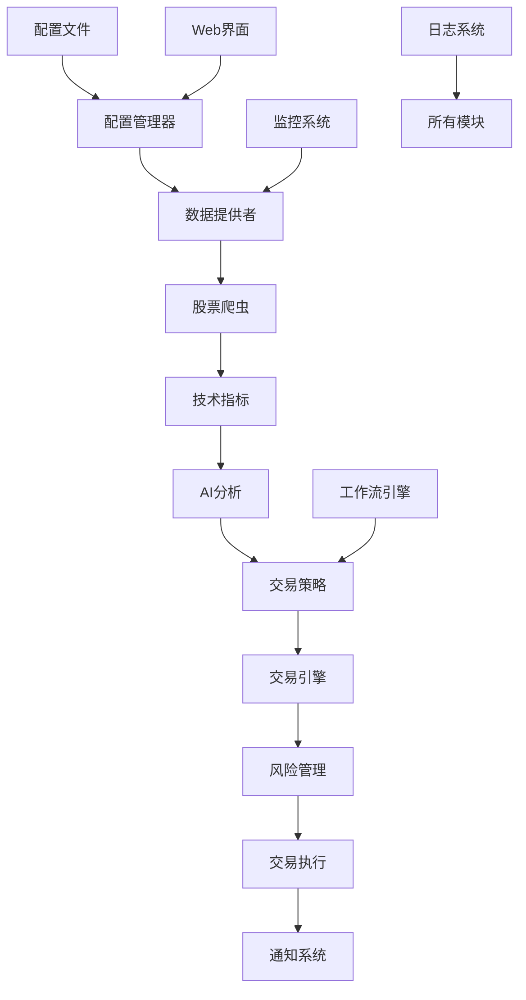

# 📁 项目结构说明

## 🏗️ 目录结构概览

```
Quant-Stock-Alpha-Engine/
├── 📄 README.md                    # 项目主文档
├── 📄 main.py                      # 系统主入口
├── 📄 config.yaml                  # 主配置文件
├── 📄 requirements.txt             # Python依赖
├── 📄 .env.example                 # 环境变量模板
├── 📄 .gitignore                   # Git忽略文件
│
├── 📁 src/                         # 源代码目录
│   ├── 📁 core/                    # 核心模块
│   │   ├── config.py               # 配置管理
│   │   ├── engine.py               # 交易引擎
│   │   └── monitor.py              # 股票监控
│   │
│   ├── 📁 data/                    # 数据模块
│   │   ├── data_provider.py        # 数据提供者
│   │   └── stock_crawler/          # 股票爬虫模块
│   │       ├── instock_adapter.py  # InStock适配器
│   │       ├── technical_indicators.py # 技术指标
│   │       ├── kline_patterns.py   # K线形态
│   │       └── enhanced_provider.py # 增强数据提供者
│   │
│   ├── 📁 ai_analysis/             # AI分析模块
│   │   ├── trading_agents_adapter.py # TradingAgents适配器
│   │   ├── llm_providers.py        # LLM提供商管理
│   │   └── multi_agent_analyzer.py # 多智能体分析器
│   │
│   ├── 📁 strategy/                # 策略模块
│   │   └── pressure_support_strategy.py # 压力支撑策略
│   │
│   ├── 📁 notification/            # 通知模块
│   │   └── wecom_notifier.py       # 企业微信通知
│   │
│   ├── 📁 web/                     # Web界面模块
│   │   ├── config_server.py        # 配置服务器
│   │   ├── templates/              # HTML模板
│   │   │   ├── base.html           # 基础模板
│   │   │   ├── index.html          # 首页
│   │   │   ├── config.html         # 配置页面
│   │   │   └── logs.html           # 日志页面
│   │   └── static/                 # 静态资源
│   │       ├── css/style.css       # 样式文件
│   │       └── js/app.js           # JavaScript应用
│   │
│   ├── 📁 workflow/                # 工作流模块
│   │   ├── n8n_integration.py      # n8n集成
│   │   └── workflow_manager.py     # 工作流管理
│   │
│   ├── 📁 models/                  # 数据模型
│   │   └── models.py               # SQLAlchemy模型
│   │
│   └── 📁 utils/                   # 工具模块
│       └── logger.py               # 日志工具
│
├── 📁 tests/                       # 测试目录
│   ├── test_config.py              # 配置测试
│   ├── test_data_provider.py       # 数据提供者测试
│   ├── test_strategy.py            # 策略测试
│   ├── test_monitor.py             # 监控测试
│   ├── test_notification.py        # 通知测试
│   ├── test_engine.py              # 引擎测试
│   ├── test_web.py                 # Web界面测试
│   └── test_integration.py         # 集成测试
│
├── 📁 scripts/                     # 脚本目录
│   ├── start.sh                    # 启动脚本
│   ├── stop.sh                     # 停止脚本
│   ├── start_web_config.py         # Web配置启动
│   ├── run_tests.py                # 测试运行器
│   └── test_system.py              # 系统测试
│
├── 📁 examples/                    # 示例目录
│   └── basic_usage.py              # 基础使用示例
│
├── 📁 docs/                        # 文档目录
│   ├── PROJECT_STRUCTURE.md        # 项目结构说明
│   ├── INTEGRATION_PLAN.md         # 集成计划
│   ├── PROJECT_SUMMARY.md          # 项目总结
│   └── UPGRADE_COMPLETE.md         # 升级完成报告
│
├── 📁 deployment/                  # 部署目录
│   ├── Dockerfile                  # Docker镜像
│   ├── docker-compose.yml          # Docker编排
│   └── deploy.sh                   # 部署脚本
│
└── 📁 logs/                        # 日志目录
    ├── trading.log                 # 交易日志
    └── error.log                   # 错误日志
```

## 📦 模块说明

### 🔧 核心模块 (src/core/)

**config.py** - 配置管理器
- 加载和验证配置文件
- 环境变量处理
- 配置模式管理

**engine.py** - 交易引擎
- 风险管理器
- 交易执行器
- 信号处理和决策

**monitor.py** - 股票监控
- 实时价格监控
- 波动率计算
- 预警系统

### 📊 数据模块 (src/data/)

**data_provider.py** - 数据提供者
- 多数据源管理
- 数据降级机制
- 实时和历史数据获取

**stock_crawler/** - 股票爬虫模块
- **instock_adapter.py**: InStock系统适配器
- **technical_indicators.py**: 32种技术指标计算
- **kline_patterns.py**: 61种K线形态识别
- **enhanced_provider.py**: 增强数据提供者

### 🤖 AI分析模块 (src/ai_analysis/)

**trading_agents_adapter.py** - TradingAgents适配器
- 多智能体协作
- AI决策生成
- 投资建议

**llm_providers.py** - LLM提供商管理
- 多LLM支持
- API密钥管理
- 成本估算

### ⚡ 策略模块 (src/strategy/)

**pressure_support_strategy.py** - 压力支撑策略
- 技术分析
- 信号生成
- 风险评估

### 📱 通知模块 (src/notification/)

**wecom_notifier.py** - 企业微信通知
- 消息发送
- 格式化
- 错误处理

### 🌐 Web界面模块 (src/web/)

**config_server.py** - 配置服务器
- Flask Web应用
- API接口
- 配置管理

**templates/** - HTML模板
- 响应式设计
- Bootstrap框架
- 实时更新

**static/** - 静态资源
- CSS样式
- JavaScript应用
- 图标和图片

### ⚙️ 工作流模块 (src/workflow/)

**n8n_integration.py** - n8n集成
- 工作流管理
- 事件处理
- 自动化任务

### 🧪 测试模块 (tests/)

- **单元测试**: 每个模块的独立测试
- **集成测试**: 模块间协作测试
- **端到端测试**: 完整系统测试
- **性能测试**: 系统性能验证

### 📜 脚本目录 (scripts/)

- **启动脚本**: 系统启动和停止
- **测试脚本**: 自动化测试运行
- **配置脚本**: Web配置界面启动

### 📚 示例目录 (examples/)

- **基础使用**: 系统核心功能演示
- **高级功能**: AI分析和工作流示例
- **最佳实践**: 推荐的使用模式

### 📖 文档目录 (docs/)

- **项目文档**: 详细的技术文档
- **集成指南**: 第三方系统集成
- **升级记录**: 版本升级历史

### 🚀 部署目录 (deployment/)

- **Docker配置**: 容器化部署
- **编排文件**: 多服务协调
- **部署脚本**: 自动化部署

## 🔄 数据流向



## 🎯 设计原则

### 1. 模块化设计
- 每个模块职责单一
- 低耦合高内聚
- 易于测试和维护

### 2. 分层架构
- 数据层：数据获取和存储
- 业务层：策略和分析
- 表现层：Web界面和API

### 3. 可扩展性
- 插件化架构
- 配置驱动
- 热插拔组件

### 4. 可维护性
- 清晰的目录结构
- 完整的文档
- 全面的测试覆盖

### 5. 安全性
- 配置文件分离
- API密钥保护
- 输入验证

## 📝 开发指南

### 添加新功能
1. 在相应模块目录创建文件
2. 编写单元测试
3. 更新配置文件
4. 添加文档说明

### 修改现有功能
1. 确保向后兼容
2. 更新相关测试
3. 更新文档
4. 进行回归测试

### 部署新版本
1. 运行完整测试套件
2. 更新版本号
3. 生成部署包
4. 执行部署脚本

## 🔧 维护建议

### 定期维护
- 更新依赖包版本
- 清理日志文件
- 备份配置和数据
- 监控系统性能

### 故障排查
1. 查看日志文件
2. 检查配置文件
3. 验证网络连接
4. 运行诊断测试

### 性能优化
- 监控内存使用
- 优化数据库查询
- 缓存频繁访问的数据
- 异步处理耗时操作

---

**📞 技术支持**: 如有问题请查看文档或提交Issue
**🔄 持续更新**: 项目结构会随着功能迭代持续优化